<h1 align="center"> Robotics Project </h1> <br>
<p align="center">
University De Bourgogne<br> 
  (VIBOT)
  <p align="center">
      
  </p>
</p>

<h3 align="center">                       
Supervisors: <br>  
 Ralph SEULIN <br>
 Daniel BRAUN
</h3>
<h4 align="center">                       
Students: <br>  
 Muhammad Izzul Azri ZAINOL AZMAN <br>
 Pranavan Ramakrishnan
</h4>
<p align="center">
  <p align = "center">
     
     
    
  </p>
</p>

## Table of Content 

- [Introduction](#introduction)
- [Project Implementation ](#Project-Implementation)<br>
  - [How to control the robot with /cmd_vel](#How-to-control-the-robot-with-/cmd_vel)
  - [How to create a mapping program launches to map the environment](#How-to-create-a-mapping-program-launches-to-map-the-environment)
  - [How to set a move base system for creating a goal to move_base and implement the obstacles avoiding algorithm](#How-to-set-a-move-base-system-for-creating-a-goal-to-move_base-and-implement-the-obstacles-avoiding-algorithm)
  - [How to create a navigation program with a set of waypoints using Rviz](#How-to-create-a-navigation-program-with-a-set-of-waypoints-using-Rviz)
- [Conclusion](#Conclusion)
- [References](#References)


## Introduction
<p align="justify">Our project is about the navigation of the Turtlebot 3 model robot. As the introduction of Turtlebot 3 burger, it is a programmable robot which runs completely on ROS and Linux. The turtlebot 3 burger that we use has a feature of LiDAR sensor which is a need for doing the SLAM gmapping. This project  requires us to accomplish a few objective which is:</p> 

- Create a script that moves the robot around with simple /cmd_vel publishing. See the range of movement of this new robot model.
- Create mapping launches, and map the whole environment. You have to finish with a clean map of the full cafeteria. Setup the launch to be able to localize the Turtlebot3 robot.
- Set up the move base system so that you can publish a goal to move_base and Turtlebot3 can reach that goal without colliding with obstacles.
- Create a program that allows the Turtlebot3 to navigate within the environment following a set of waypoints. 

<p align="justify">This objective will help us to understand more about using and implementation of our knowledge on the ground-based robot. We will use the constructsim platform which is similar to a virtual environment. This simulation offers us a very good user interface and is user friendly. The main thing that was necessary for the success of this project was understanding the ROS based system, using the right tool for the visualisation of the mapping and the right packages to be used to drive the robot and navigate. Besides that, we will be using RViz for visualization, Gazebo to simulate the virtual world, rqt_graph for the visualizing the ROS computation graph and mainly using a python programming language for the scripts.</p> 


## Project Implementation<br>

## How to control the robot with /cmd_vel<br>
_Objective_: Create a script that moves the robot around with simple /cmd_vel publishing. See the range of
movement of this new robot model.

<!--Put Your content-->

## How to create a mapping program launches to map the environment<br>
_Objective_: Create mapping launches, and map the whole environment. You have to finish with a clean map of the full cafeteria. Setup the launch to be able to localize the Turtlebot3 robot.<br>
<!--Put Your content-->

## How to set a move base system for creating a goal to move_base and implement the obstacles avoiding algorithm<br>
_Objective_: Set up the move base system so that you can publish a goal to move_base and Turtlebot3 can reach that goal without colliding with obstacles.<br>
<!--Put Your content-->
<p align="justify"> <strong>Task 1</strong> and <strong>Task 2</strong> is regarding creating a mapping and subscribing to cmd_vel for moving the robot. In this <strong>task 3</strong>, we need to plan the path for the turtlebot to reach the specific goal witout hitting an obstacles through the path that the turtlebot take. To be able to do that, we will use a ros package which <strong>move_base</strong> package. <strong>Move_base</strong> is for moving the robot to a goal pose within a given reference frame. The <strong>move_base</strong> package are implementing the <strong>ROS action</strong> for reaching a given the goal that is published. This is involving the <strong>actionlib</strong> which a a package for interfacing with preemptable tasks. As example, <strong>actionlib</strong> can be used for moving the base to target location, performing a laser scan and returning the resulting point cloud, detecting the handle of a door and many more. The <strong>move_base</strong> package is using the <strong>base_local_planner</strong> that will combines the odometry data with both global and local cost maps when planning the path for the robot to reach the goal. The path is computed before the robot starts moving toward the next goal and obstacles are being takes into consideration for avoiding.</p>
<br>

__The Configuration Parameter for Path Planning__<br>
<p align="justify">The <strong>move_base</strong>  node will require 5 configuration files before it can be run. These files is related to the cost of running into obstacles, the radius of the robot, how far into the future the path planner should look and the velocity of the robot to move. The 5 configurations files which I have created for the move_base nodes are:</p>

- <a href="t3_navigation/param/costmap_common_params_burger.yaml">costmap_common_params_burger.yaml</a> : The parameter of costamp configuration consists of turtlebot3 model burger
- <a href="t3_navigation/param/local_costmap_params.yaml">local_costmap_params.yaml</a>: The parameter of the local area motion planning 
- <a href="t3_navigation/param/global_costmap_params.yaml">global_costmap_params.yaml</a>: The parameter of global area motion planning 
- <a href="t3_navigation/param/move_base_params.yaml">move_base_params.yaml</a>: The parameters setting file for move_base that supervise the motion planning
- <a href="t3_navigation/param/dwa_local_planner_params.yaml">dwa_local_planner_params.yaml</a>: The parameter of the speed command to the robot
<br>

<p align="justify">To use the parameters that we have created and to execute task 3, we have created a launch file which is called <a href="t3_navigation/launch/start_navigation.launch">start_navigation.launch</a> that include <strong>turtlebot 3 launch</strong>, <strong>map sever</strong>, <strong>AMCL</strong>, <strong>rviz</strong> and <strong>move base node</strong></p><br>

As we can see in the **start_navigation.launch** file we can see that, we have include the move_base node launch which will launch all the 5 configuration files that include the parameters that requires for the move_base node. Here is the lines of the move_base configuration in the launch file:

    <!-- move_base -->
    <arg name="cmd_vel_topic" default="/cmd_vel" />
    <arg name="odom_topic" default="odom" />
    <node pkg="move_base" type="move_base" respawn="false" name="move_base" output="screen">
      <param name="base_local_planner" value="dwa_local_planner/DWAPlannerROS" />

      <rosparam file="$(find t3_navigation)/param/costmap_common_params_$(arg model).yaml" command="load" ns="global_costmap" />
      <rosparam file="$(find t3_navigation)/param/costmap_common_params_$(arg model).yaml" command="load" ns="local_costmap" />
      <rosparam file="$(find t3_navigation)/param/local_costmap_params.yaml" command="load" />
      <rosparam file="$(find t3_navigation)/param/global_costmap_params.yaml" command="load" />
      <rosparam file="$(find t3_navigation)/param/move_base_params.yaml" command="load" />
      <rosparam file="$(find t3_navigation)/param/dwa_local_planner_params.yaml" command="load" />

      <remap from="cmd_vel" to="$(arg cmd_vel_topic)"/>
      <remap from="odom" to="$(arg odom_topic)"/>
    </node>

<br>

To execute Task 3, 
We will start with running the launch file that we mentioned above as follow:

    roslaunch t3_navigation start_navigation.launch 

Then, we will to go RViz to initalize the robot pose and creating a goal for the robot to follow. In RViz we will see as follow:
<p align="center">
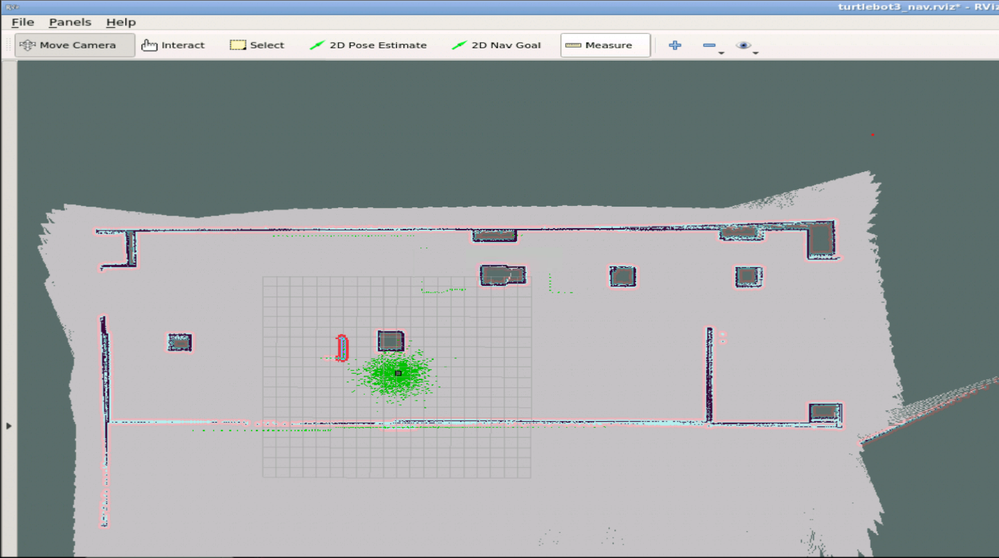</p>

We will see the rqt_graph for the visualization of how the nodes are connected for subscribing the move_base node:
<p align="center">
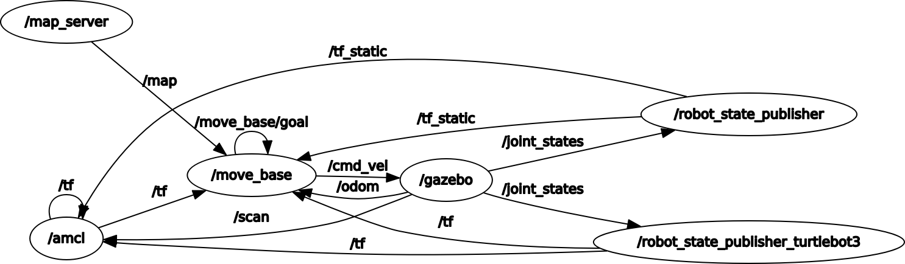</p>

<p align="justify">We will need to use the <strong>2D Pose Estimate</strong> function in the RViz in order to initiliaze the robot pose. After the initilization has done, we will continue to use <strong>2D Nav Goal</strong> function to publish the goal for the turtlebot to follow.</p>
<br>
As figures below is showing the use of the 2D Pose Estimate in RViz for the pose initiliazation of the turtlebot 3 burger:
<p align="center">
</p>
The next figure is regarding the 2D Nav goal which is to tell the turtlebot to go to the desired goal:
<p align="center">
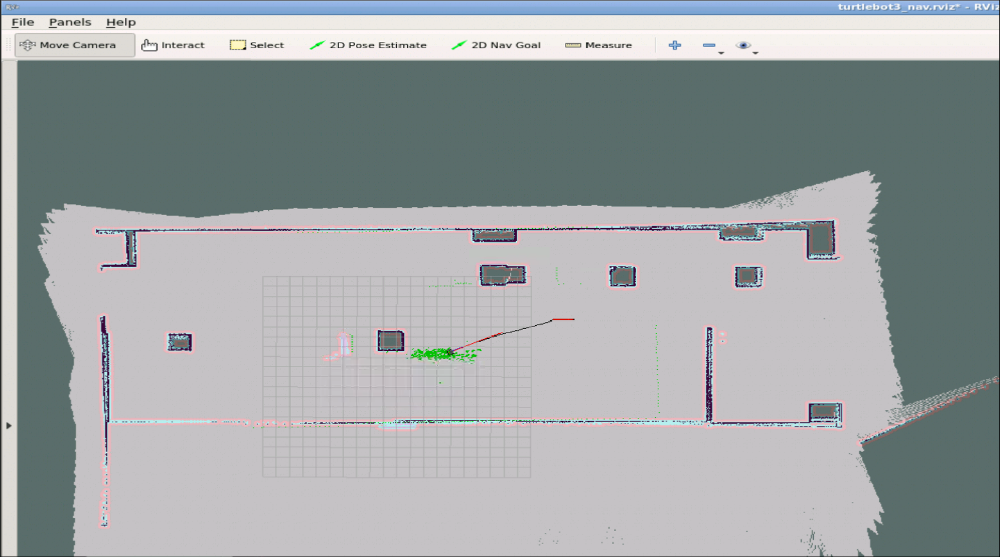</p>
<br>

By using  ```rostopic echo /move_base/goal``` we will see the goal position and orientation 
<p align="center">
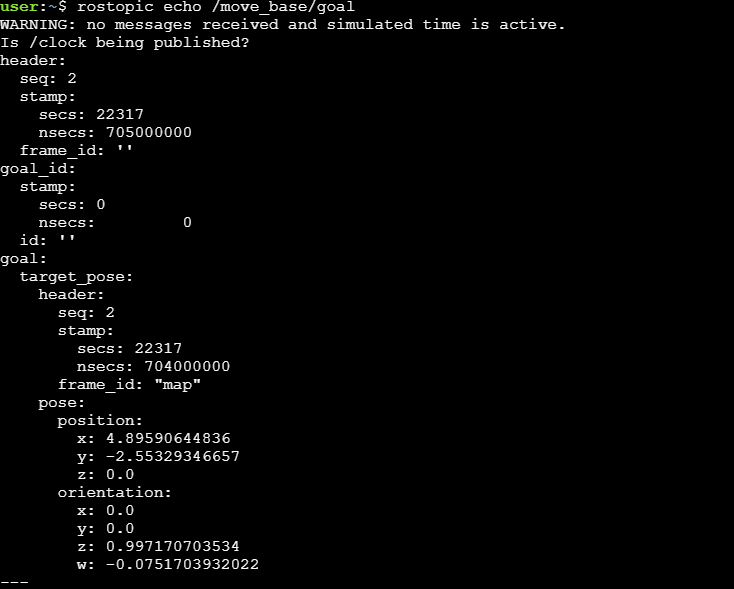</p>

<p align="justify">For implementing the Task3, we will be using the ROS Packages follow_waypoints by daniel snider for demonstrating how we can publishing the goal throught the terminal to reach the goal. We will start by running our start_navigation launch as below:
  
    roslaunch t3_navigation start_navigation.launch 
Then we will launch the follow waypoints packages to start the waypoint server. The server will subscribe to the /initialpose topic and store the pose until it asked to send to ***move_base*** to be executed. Run as follows:

    roslaunch follow_waypoints follow_waypoints.launch 
After running that, see in RViz and add the PoseArray element and subscribe it to topic of /waypoints as you can see in figure below to show all the waypoints that we will set.  
<p align="center">
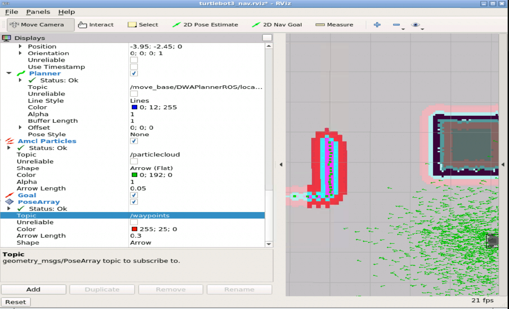</p>

After that use the 2D Pose Estimate in RViz for the pose initiliazation of the turtlebot 3 burger and set the goal for the robot to follow:
<p align="center">
</p>

And in the terminal it will show this:

    [INFO][140446249940736][/follow_waypoints/execute:189]: Recieved newwaypoint

Now, after the waypoint is set. We publish it to topic /path_ready to send the goal to the move_base.

    rostopic pub /path_ready std_msgs/Empty -1
We will see the robot move to the goal the we just set. 
<p align="center">
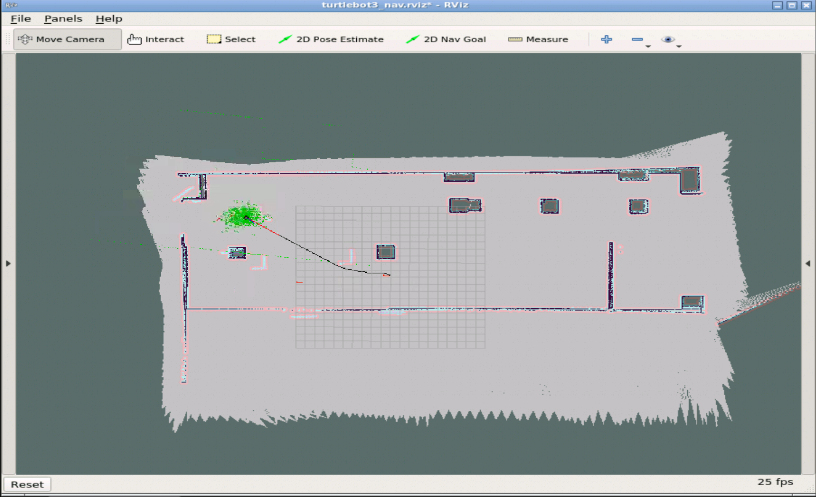</p>

__Demonstration__ of Task 3:<br>
<p align="center">
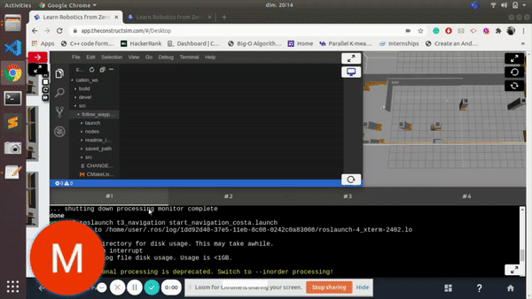</p> <br>
Please click this link to download the full <a href="Resources/Videos/task3_video.mp4">video</a>


## How to create a navigation program with a set of waypoints using Rviz<br>
_Objective_: Create a program that allows the Turtlebot3 to navigate within the environment following a set of waypoints. Waypoints locations are presented on the next page.<br>
To launch the navigation file:   
<br>
_Execution_: The next task is to create a program that allows the Turtlebot3 to navigate within the environment following a set of waypoints. Waypoints locations are presented on the below figures. 
<p align="center">
  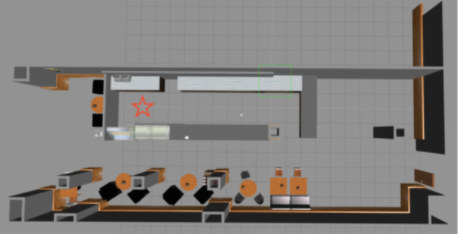
</p>
<p align="center">
  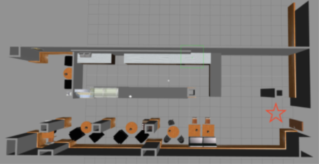
</p>
<p align="center">
  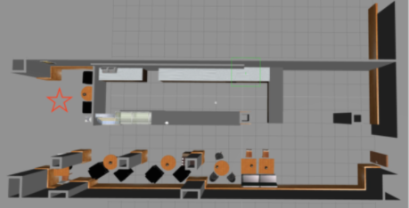
</p>
<br>
<p align="justify"> In here we got three figures which are the three different waypoints that need to be achieved. In order to develop a ROS program that allows the robot to navigate to those locations, we first need to know what are the (x,y) coordinates of these waypoints onto the map. Then, we will use the coordinate to define the navigation mission that we submit to the robot’s navigation stack to execute it. Remember that any robot on ROS  runs the move_base navigation stack which allows the robot to find a path towards a goal and execute the path following while avoiding obstacles. The setup of the terminal, gazebo and RViz should follow as below for easiness of getting the coordinates.</p>
<p align="center">
  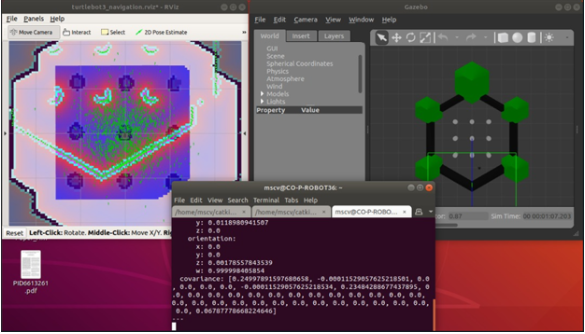
</p>

<p align="justify"> The first step is to open the map which we have been mapping. By using the RViz to visualize the map, we use the 2D Pose estimate to get the waypoint coordinates. After all, it has been set up as below, open another terminal and write rostopic echo /amcl_pose to get the location of the robot on the map. While not closing the terminal, go back to RViz the click on 2D Pose Estimate button, then click to one of the waypoints on the map. Go back to the terminal where the command of rostopic echo /amcl_pose been running, and you will find the coordinate of the point selected.</p>

The second step is to find the location of interest. As an example, the Position(x,y,z) and Orientation(x,y,z, w)coordinates of the three waypoints should look like these values:

    locations['waypoint_1'] = Pose(Point(-9.48563145743, 0.993861001173, 0.00), Quaternion(0.000, 0.000, 0.0975400737238, 0.999992502992))
    locations['waypoint_2'] = Pose(Point(8.78885627481, -3.8867439838, 0.000), Quaternion(0.000, 0.000, 0.705633593091, 0.70857690641))
    locations['waypoint_3'] = Pose(Point(-12.4087143203, 0.260407563831, 0.000), Quaternion(0.000, 0.000, -0.999993994471, 0.0034656921885))

<br>
<p align="justify">The final step is to write the navigation program. The navigation program will be written in Python languages which will use the rospy, actionlib and others ROS or turtlebot library. In the program code, we will include the coordinates of the waypoints and will let the user choose either to go to the waypoint 1, 2 or 3. Besides that, it can autonomously navigate through the whole 3 waypoints. The figure below shows the flowchart of the navigation program for turtlebot to reach all of the waypoints. The points set in the flowchart are as an example of the program flow.</p>
<p align="center">
  
</p>


To launch the navigation
    
    roslaunch t3_navigation start_navigation.launch
 <br>
To launch the autonomous navigation to waypoints:

    roslaunch t3_waypoint autonomous_navigation.launch
    
__Demonstration__ of Task 4:<br>
<p align="center">
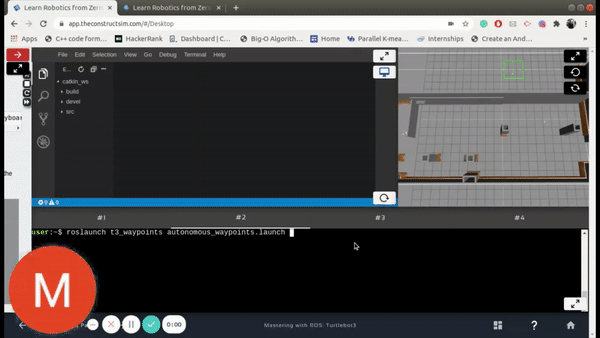</p> <br>
Please click this link to download the full <a href="Resources/Videos/task4_video.mp4">video</a>


## Conclusion
<p align="justify">As conclusions, here we are trying to explain from top to bottom on how to handle the turtlebot 3 model burger. We start with the Introduction of the turtlebot 3. Then we continue to explain in detail for the Project Implementation that is started with the creation of a script that moves the robot around with simple /cmd_vel publishing. See the range of movement of this new robot model. Next details on how to create the mapping launches, and map the whole environment. Then, set up the move base system so that it can publish a goal to move_base and Turtlebot3 can reach that goal without colliding with obstacles. Lastly, create a program that allows the Turtlebot3 to navigate within the environment following a set of waypoints. For now, the implementation of task 4 is successfully going and the next plan was to create an autonomous script to go to three of the waypoints. We believe the approach that we demonstrated above is able to be implemented for project development success. </p> <br>

## References
* Amsters, Robin & Slaets, Peter. (2020). Turtlebot 3 as a Robotics Education Platform. 10.1007/978-3-030-26945-6_16.<br> 
* Esteve. (2019, October 25). Turtle_Bot3_BringUp For ROS. WikiROS. http://wiki.ros.org/turtlebot3_bringup?distro=kinetic<br>
* G. (n.d.). Wiki. Retrieved (February 4, 2020). Retrieved from http://wiki.ros.org/gmapping<br> 
* Jung, L. (2019, December 31). ROBOTIS. (ROBOTIS Co.,Ltd.) Retrieved from https://emanual.robotis.com/docs/en/platform/turtlebot3/overview/#overview<br> 
* Pyo, Y. (2018, April 4). Wiki ROS. Retrieved from turtlebot3_simulations: http://wiki.ros.org/turtlebot3_simulations


